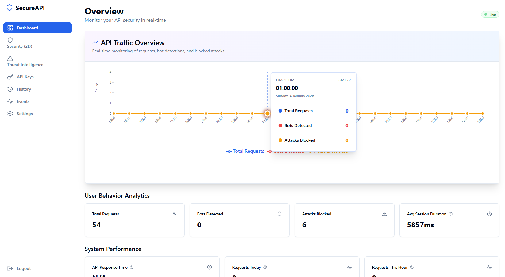
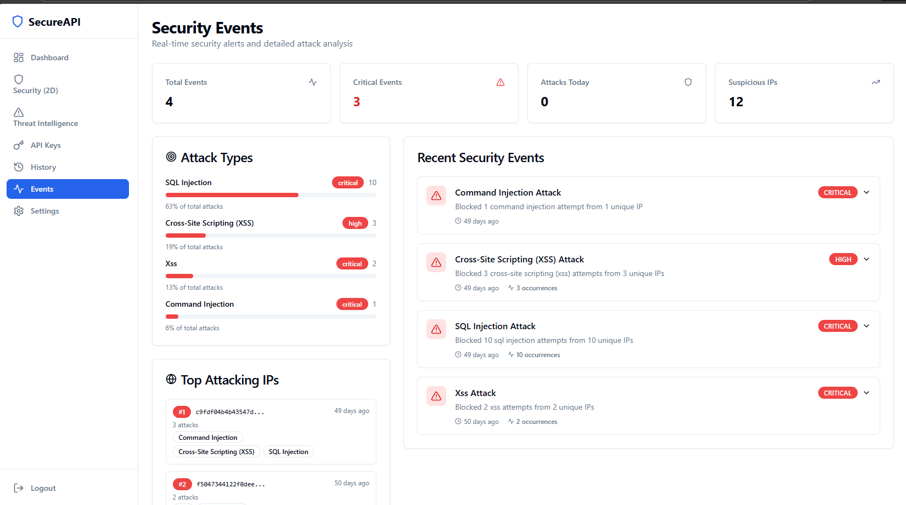
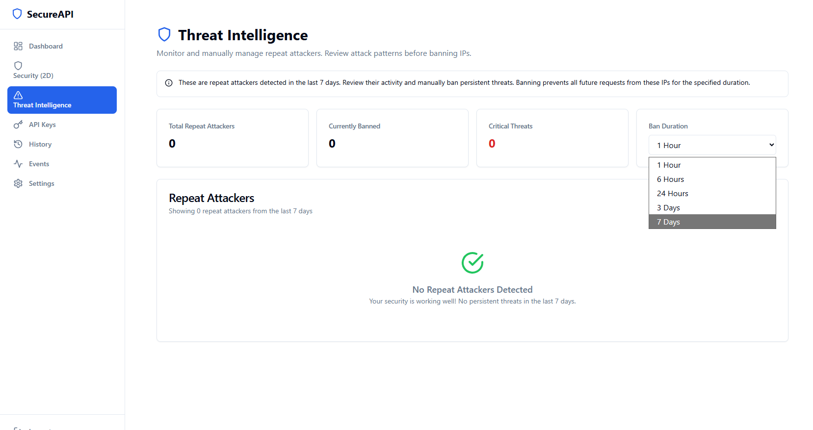
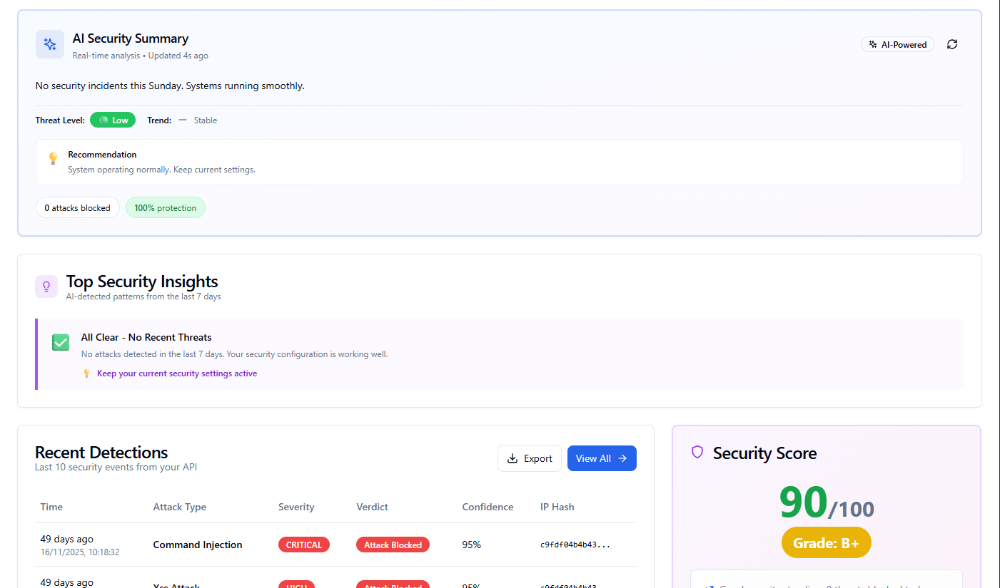

# 🛡️ Secure API 

<div align="center">

**AI-Driven API & Website Security Platform**

*Building the future of accessible cybersecurity*


[Features](#-features) • [Vision](#-our-vision) • [Architecture](#-architecture) • [Screenshots](#-screenshots) • [Tech Stack](#-tech-stack)

</div>

---

## 🌍 Our Vision

> **The Challenge We're Solving**

In the coming years, **digital security will be one of humanity's greatest challenges**. Even the world's largest corporations face devastating data breaches and misuse of personal information. Yet quality cybersecurity remains out of reach for those who need it most: small businesses, freelancers, and individuals with online presence.

> **What We're Building**

A security platform that evolves with threats through:

- 🤖 **Self-learning AI** that adapts using machine learning
- ⚛️ **Quantum-ready architecture** preparing for post-quantum cryptography
- 🔒 **Privacy-first design** with no personal data collection
- 🌍 **Accessible protection** for everyone, regardless of budget

---

## 💡 The Core Innovation

### Beyond "Is This a Bot?"

Traditional security asks one question. **We ask two:**

<table>
<tr>
<td width="50%">

### 1️⃣ WHO is making the request?

- 🤖 **Verified Bot** (Googlebot, legitimate crawlers)
- 🔧 **Likely Bot** (automated tools, scrapers)
- 👤 **Likely Human** (real browser, natural behavior)
- ❓ **Suspicious** (unclear signals)

</td>
<td width="50%">

### 2️⃣ WHAT are they trying to do?

- ✅ **Legitimate** (normal usage)
- ⚠️ **Suspicious** (unusual patterns)
- 🚨 **Attack** (SQL injection, XSS)
- 🔴 **Abuse** (rate limit violations)

</td>
</tr>
</table>

**This 2D Classification enables intelligent responses:**
- ✅ Allow verified bots to do their job
- 🤔 Challenge suspicious users with CAPTCHA
- ❌ Block attacks instantly
- 📊 Learn from every interaction

---

## ⚙️ Features

<details open>
<summary><b>🤖 AI-Powered Detection (Experimental)</b></summary>

- Google Gemini integration for security intelligence
- Behavioral pattern analysis
- Daily AI-generated security summaries
- Attack confidence scoring (0-100)
- Natural language threat explanations

</details>

<details open>
<summary><b>🛡️ Multi-Layer Security</b></summary>

- Kong API Gateway (rate limiting, authentication)
- ModSecurity WAF (OWASP Core Rule Set)
- Custom AI detection engine
- 9 attack type classifications
- Automatic threat blocking

</details>

<details open>
<summary><b>📊 Real-Time Dashboard (In Progress)</b></summary>

- Live traffic monitoring
- 24-hour analytics charts
- Security event feed
- 2D decision matrix visualization
- Threat intelligence tracking

</details>

<details open>
<summary><b>🏢 Multi-Tenant Foundation</b></summary>

- Secure authentication system
- API key management (SHA-256 hashing)
- Per-tenant usage tracking
- Isolated data storage
- Connection pooling for performance

</details>

---

## 🏗️ Architecture

```
┌─────────────────────────────────────────┐
│          User Request                    │
└──────────────┬──────────────────────────┘
               │
               ▼
┌─────────────────────────────────────────┐
│  Layer 1: Kong API Gateway              │
│  • Rate limiting (10 req/sec)           │
│  • API key authentication               │
│  • Request validation                   │
└──────────────┬──────────────────────────┘
               │
               ▼
┌─────────────────────────────────────────┐
│  Layer 2: ModSecurity WAF               │
│  • OWASP Core Rule Set                  │
│  • SQL Injection blocking               │
│  • XSS prevention                       │
│  • Command injection detection          │
└──────────────┬──────────────────────────┘
               │
               ▼
┌─────────────────────────────────────────┐
│  Layer 3: AI Detection Engine           │
│  • Behavioral analysis                  │
│  • 2D classification                    │
│  • CAPTCHA challenges                   │
│  • Pattern learning                     │
└──────────────┬──────────────────────────┘
               │
               ▼
         Protected Application
```

---

## 📸 Screenshots

### Dashboard Overview
> Real-time traffic monitoring with AI-powered insights


*24-hour traffic charts, statistics, and AI security summary*

---

### Security Events Feed
> Live attack detection and classification


*Real-time security events with detailed attack information*

---

### 2D Decision Matrix
> Visual representation of actor × intent classification


*Heatmap showing traffic patterns across actor and intent types*

---

### Threat Intelligence
> Track and manage repeat attackers


*Repeat attacker detection with manual IP management*

---

### AI Security Insights
> Gemini-powered security analysis


*Natural language security summaries and recommendations*

---

## 🧰 Tech Stack

<table>
<tr>
<td valign="top" width="33%">

### Backend
- **Python 3.11+**
  - Flask web framework
  - Gunicorn WSGI server
- **PostgreSQL 15**
  - Multi-tenant data
  - Connection pooling
- **Redis 7**
  - Caching layer
  - Session storage

</td>
<td valign="top" width="33%">

### Frontend
- **React 18**
  - TypeScript
  - Component library
- **Tailwind CSS**
  - Responsive design
- **shadcn/ui**
  - Modern components
- **Recharts**
  - Data visualization
- **Vite**
  - Fast build tool

</td>
<td valign="top" width="33%">

### Security & AI
- **Kong Gateway**
  - API routing
  - Rate limiting
- **ModSecurity**
  - OWASP CRS
  - WAF protection
- **Gemini AI**
  - Security intelligence
  - Pattern analysis
- **Docker**
  - Containerization

</td>
</tr>
</table>

---

## 🚧 Development Status

| Component | Status | Progress |
|-----------|--------|----------|
| Core Detection Logic | 🔄 In Progress | ████████░░ 80% |
| AI Integration (Gemini) | 🔄 Experimental | ██████░░░░ 60% |
| Dashboard UI | 🔄 Basic | ███████░░░ 70% |
| Multi-Tenant System | 🔄 In Progress | ███████░░░ 70% |
| WordPress Plugin | 📋 Planned | ░░░░░░░░░░ 0% |
| Custom ML Models | 📋 Research | ██░░░░░░░░ 20% |
| Quantum Security | 📋 Research | █░░░░░░░░░ 10% |

---

## 🛣️ Future Direction

We're actively working on expanding capabilities in these areas:

```
Enhanced Detection → Self-Learning AI → Quantum Security → Ecosystem Growth
```

**Planned developments include:**
- Browser fingerprinting and device tracking
- Custom ML model training and anomaly detection
- Post-quantum cryptography research
- Platform integrations and mobile SDKs

---

## 🙏 Built With Open Source

We stand on the shoulders of giants:

| Category | Tools |
|----------|-------|
| **Security** | [OWASP ModSecurity](https://github.com/SpiderLabs/ModSecurity) • [Kong Gateway](https://github.com/Kong/kong) |
| **AI** | [Google Gemini](https://ai.google.dev/) • [NumPy](https://numpy.org/) |
| **Backend** | [Flask](https://flask.palletsprojects.com/) • [PostgreSQL](https://www.postgresql.org/) • [Redis](https://redis.io/) |
| **Frontend** | [React](https://react.dev/) • [TypeScript](https://www.typescriptlang.org/) • [Tailwind](https://tailwindcss.com/) |
| **Infrastructure** | [Docker](https://www.docker.com/) • [Nginx](https://nginx.org/) |

---

## ⚠️ Important Notice

> **SecureAPI Shield is currently in private development.**
> 
> - Platform is being actively built and tested
> - Not publicly available yet
> - Features and architecture are evolving
> - This repository serves as a project showcase

This represents ongoing development work, not a released product.

---

<div align="center">

### 🌟 Why This Matters

*Digital security shouldn't be a privilege of large corporations.*

**We're building for:**

📝 Bloggers • 🛒 E-commerce • 💻 Developers • 🚀 Startups • 👥 Communities

---

⭐ **Star this repo if you believe in democratizing cybersecurity**

*Building the future, one commit at a time.*

</div>
